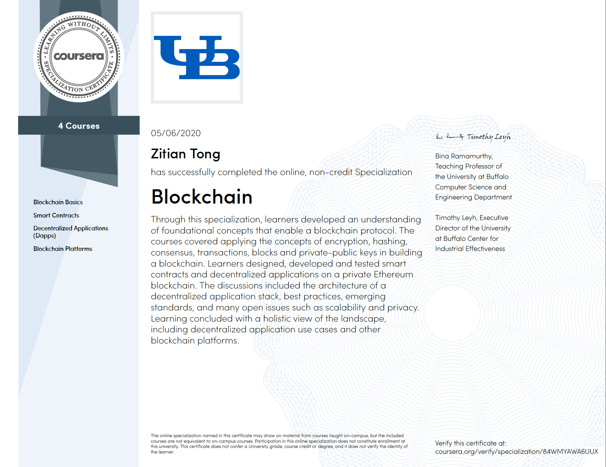

# Blockchain_Specialization
Projects for Courses at Coursera Blockchain Specialization (The State University of New York at Buffalo)

## Speicalization Certificate Screenshot

## Course Content
This coursera course has 4 major parts:
1. Blockchain Basics
2. Smart Contract (Based on ETH)
3. Dapp Development
4. Blockchain Plantforms (Hyperledger, IPFS, Hashgraph ....)

## Projects

This course has 4 major projects for each topic:
1. Running ETH Virtual Machine:  
 [Project 1 Running ETH VM Folder](Part1-Basics)

2. Auction Smart Contract Project:  
 [Project 2 Auction Smart Contract Folder](Part2-Smart_Contract/Auction_Project)

3. Dapp Auction Test Project:  
 [Project 3 Auction Smart Contract Test Folder](Part3-Dapps/Final_Project)

4. Blockchain Plantforms IPFS Project:  
 [Project 4 IPFS Project Folder](Part4-Blockchain_Plantforms)   
 [Download Link for IPFS](https://docs.ipfs.io/guides/guides/install/)

